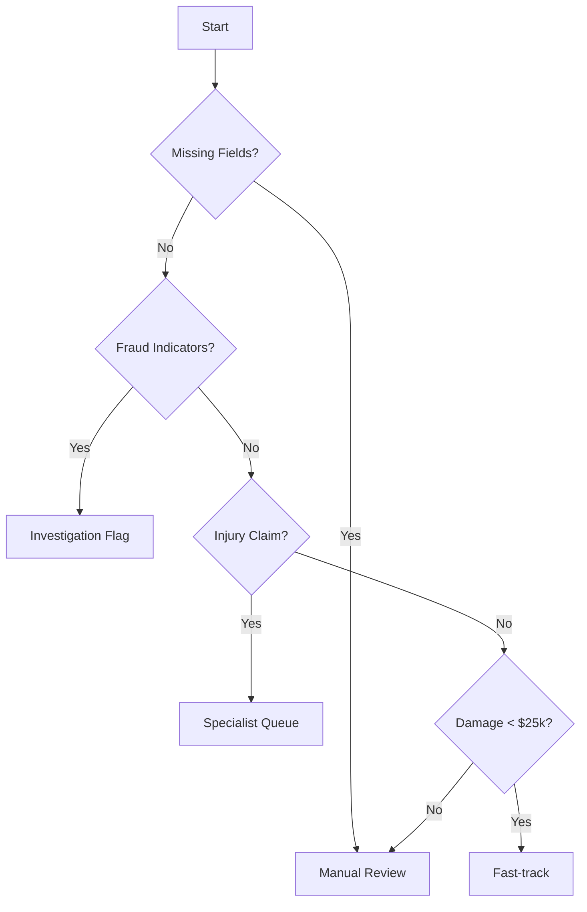

# Insurance Claims Processing Agent(Shubham Gupta)

An autonomous AI-powered agent that processes ACORD FNOL (First Notice of Loss) documents, extracts key information, validates data, and routes claims based on business rules.

## 🎯 Overview

This system automates the initial processing of insurance claims by:
- **Extracting** structured data from PDF documents
- **Validating** mandatory fields and data consistency
- **Routing** claims to appropriate queues based on business logic
- **Providing** clear reasoning for routing decisions

## ✨ Features

### Data Extraction
- AI-powered extraction using **OpenAI GPT-4o-mini**
- Fallback regex-based extraction for reliability
- Supports ACORD form format
- Handles varied PDF layouts

### Field Validation
- Identifies missing mandatory fields
- Checks data consistency
- Validates damage estimates
- Flags incomplete submissions

### Intelligent Routing

| Route | Criteria |
|-------|----------|
| **Fast-track** | Damage < $25,000 AND all fields complete AND no fraud/injury indicators |
| **Manual Review** | Missing mandatory fields OR high-value claims (≥ $25,000) |
| **Investigation Flag** | Fraud keywords detected ("fraud", "inconsistent", "staged", etc.) |
| **Specialist Queue** | Injury claims or injury-related keywords |

**Priority Order**: Manual Review → Investigation → Specialist → Fast-track

### Mandatory Fields
- Policy Number
- Policyholder Name
- Date of Loss
- Location
- Claim Type
- Estimated Damage
- Claimant Information

## 🏗️ Architecture

```
insurance-claims-agent/
├── src/
│   ├── models.py          # Pydantic data models
│   ├── config.py          # Configuration & settings
│   ├── extractor.py       # PDF extraction logic
│   ├── validator.py       # Field validation
│   ├── router.py          # Routing logic
│   └── main.py            # Main application
├── data/
│   ├── input/             # Input PDF files
│   └── output/            # JSON outputs
├── tests/
│   ├── test_extractor.py  # Extractor tests
│   ├── test_validator.py  # Validator tests
│   ├── test_router.py     # Router tests
│   └── sample_fnol/       # Sample test documents
├── scripts/
│   └── convert_to_pdf.py  # Utility to convert text to PDF
├── requirements.txt
├── .env.example
└── README.md
```

## 🚀 Quick Start

### Prerequisites
- Python 3.8 or higher
- OpenAI API key (for AI extraction)

### Installation

1. **Clone the repository**
   ```bash
   cd /Users/shubhamgupta/Desktop/Insurance_claim_Agent
   ```

2. **Create virtual environment**
   ```bash
   python -m venv venv
   source venv/bin/activate  # On Windows: venv\Scripts\activate
   ```

3. **Install dependencies**
   ```bash
   pip install -r requirements.txt
   ```

4. **Configure environment**
   ```bash
   cp .env.example .env
   ```
   
   Edit `.env` and add your OpenAI API key:
   ```
   OPENAI_API_KEY=your_actual_api_key_here
   ```

### Usage

#### Process a Single Claim

```bash
python -m src.main --input data/input/claim.pdf
```

#### Process Multiple Claims

```bash
python -m src.main --input-dir data/input/
```

#### Specify Output Directory

```bash
python -m src.main --input claim.pdf --output-dir data/output/
```

#### Use Without AI (Regex Only)

```bash
python -m src.main --input claim.pdf --no-ai
```

### Command-Line Options

| Option | Description |
|--------|-------------|
| `--input PATH` | Path to single PDF file |
| `--input-dir PATH` | Directory containing PDF files |
| `--output-dir PATH` | Output directory (default: `data/output`) |
| `--no-ai` | Disable AI extraction, use regex only |

## 📊 Sample Documents

The project includes 5 sample FNOL documents for testing:

1. **fast_track_claim.txt** - Simple claim, $12,500 damage, all fields complete
2. **missing_fields_claim.txt** - Missing policy number and contact info
3. **fraud_investigation_claim.txt** - Contains fraud keywords
4. **injury_claim.txt** - Personal injury with hospital transport
5. **complex_claim.txt** - High-value multi-party claim, $125,000

### Generate PDF Samples

```bash
python scripts/convert_to_pdf.py
```

This converts all `.txt` files in `tests/sample_fnol/` to PDF format.

## 🧪 Testing

### Run All Tests

```bash
pytest tests/ -v
```

### Run Specific Test Module

```bash
pytest tests/test_router.py -v
pytest tests/test_validator.py -v
pytest tests/test_extractor.py -v
```

### Test Coverage

```bash
pytest --cov=src tests/
```

## 📤 Output Format

The agent produces JSON output with the following structure:

```json
{
  "claim_id": "uuid-string",
  "processed_at": "2026-02-08T16:00:00",
  "extracted_fields": {
    "policy_information": {
      "policy_number": "POL-123456",
      "policyholder_name": "John Doe",
      "effective_dates": "2025-01-01 to 2026-01-01"
    },
    "incident_information": {
      "date_of_loss": "2026-02-01",
      "time_of_loss": "14:30",
      "location": "123 Main St, City, State",
      "description": "Vehicle collision at intersection"
    },
    "involved_parties": {
      "claimant": "John Doe",
      "contact_details": {
        "phone": "555-1234",
        "email": "john@example.com"
      }
    },
    "asset_details": {
      "asset_type": "Vehicle",
      "asset_id": "VIN123456789",
      "estimated_damage": 15000
    },
    "claim_type": "auto",
    "initial_estimate": 15000
  },
  "missing_fields": [],
  "recommended_route": "Fast-track",
  "reasoning": "Claim meets fast-track criteria: estimated damage ($15,000.00) is below $25,000.00 threshold and all mandatory fields are present. No fraud indicators or injury claims detected."
}
```

## ⚙️ Configuration

### Environment Variables

| Variable | Description | Default |
|----------|-------------|---------|
| `OPENAI_API_KEY` | OpenAI API key | - |
| `FAST_TRACK_THRESHOLD` | Dollar threshold for fast-track | `25000` |
| `LOG_LEVEL` | Logging level | `INFO` |

### Customizing Routing Rules

Edit `src/config.py` to modify:
- Fast-track threshold
- Mandatory fields list
- Fraud detection keywords
- Injury-related keywords

## 🔍 How It Works

### Processing Pipeline


### Routing Logic



## 🛠️ Development

### Project Structure

- **models.py** - Pydantic models for type-safe data structures
- **config.py** - Centralized configuration management
- **extractor.py** - PDF parsing and field extraction
- **validator.py** - Data validation and consistency checks
- **router.py** - Business logic for claim routing
- **main.py** - CLI application and orchestration

### Adding New Routing Rules

1. Update `src/config.py` with new keywords or thresholds
2. Modify `src/router.py` to implement new logic
3. Add tests in `tests/test_router.py`

### Extending Field Extraction

1. Add new fields to models in `src/models.py`
2. Update extraction logic in `src/extractor.py`
3. Add field mappings in `src/config.py`

## 📝 Example Workflow

```bash
# 1. Set up environment
cp .env.example .env
# Edit .env with your API key

# 2. Install dependencies
pip install -r requirements.txt

# 3. Generate sample PDFs
python scripts/convert_to_pdf.py

# 4. Process sample claims
python -m src.main --input-dir tests/sample_fnol/

# 5. Check outputs
ls -la data/output/
cat data/output/fast_track_claim_output.json
```

## 🎯 Expected Results

When processing the sample documents:

| Document | Expected Route | Reason |
|----------|---------------|--------|
| fast_track_claim.pdf | Fast-track | $12,500 < $25,000, complete |
| missing_fields_claim.pdf | Manual Review | Missing policy #, estimate |
| fraud_investigation_claim.pdf | Investigation Flag | Fraud keywords detected |
| injury_claim.pdf | Specialist Queue | Injury claim type |
| complex_claim.pdf | Manual Review | $125,000 > $25,000 |

## 🤝 Contributing

1. Fork the repository
2. Create a feature branch
3. Make your changes
4. Add tests
5. Submit a pull request

## 📄 License

This project is provided as-is for educational and assessment purposes.

## 🙋 Support

For questions or issues:
- Review the sample documents in `tests/sample_fnol/`
- Check the test files for usage examples
- Ensure your `.env` file is properly configured

## 🔐 Security Notes

- Never commit `.env` files with real API keys
- Keep API keys secure and rotate regularly
- Validate all input PDFs before processing
- Review extracted data for accuracy

## 🚦 Status Indicators

The application provides clear console output:

- ✓ Success indicators
- ⚠ Warning messages
- ❌ Error notifications

## 📈 Performance

- Average processing time: 2-5 seconds per claim (with AI)
- Regex-only mode: < 1 second per claim
- Supports batch processing of multiple claims
- Scalable architecture for production deployment

---

**Built for**: Insurance Claims Processing Assessment  
**Technology**: Python, OpenAI GPT-4, pdfplumber, Pydantic  
**Version**: 1.0.0
